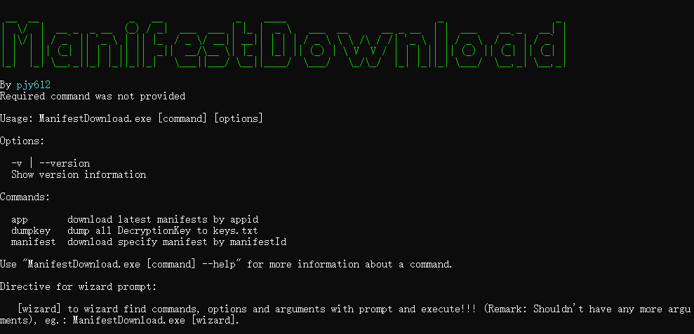
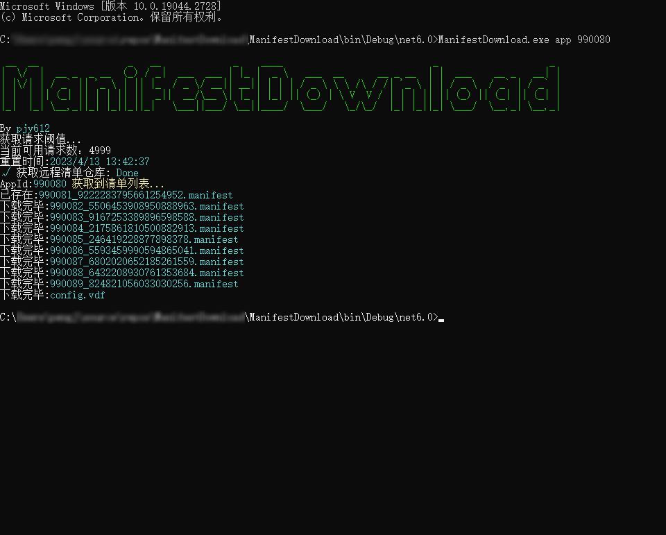
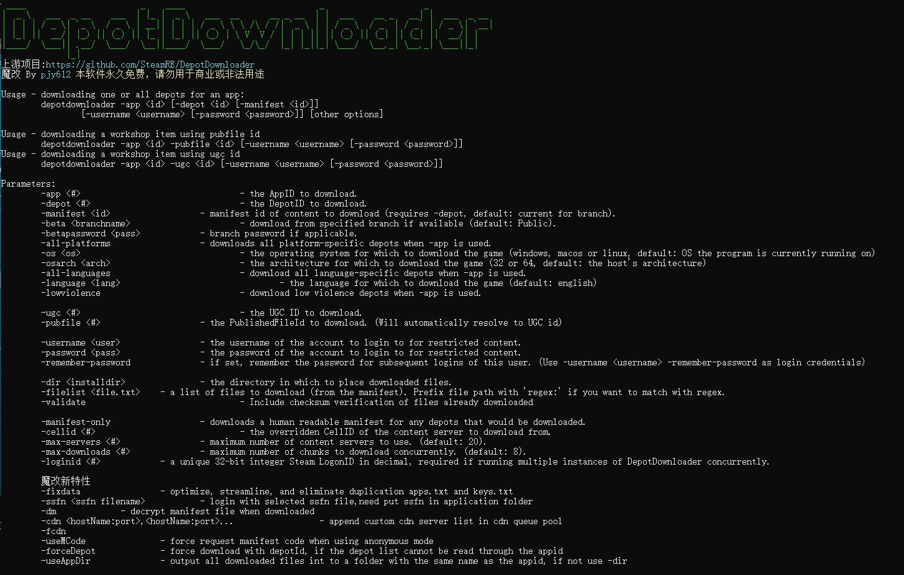
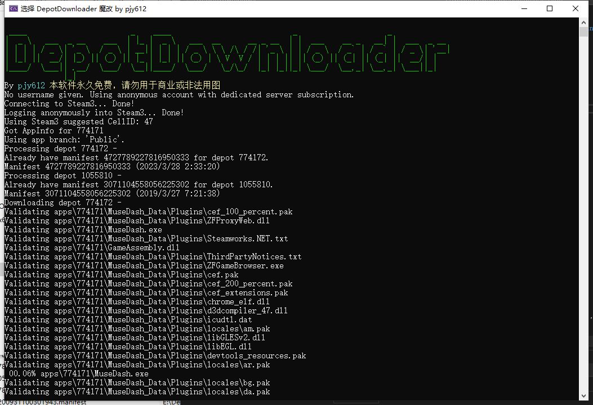
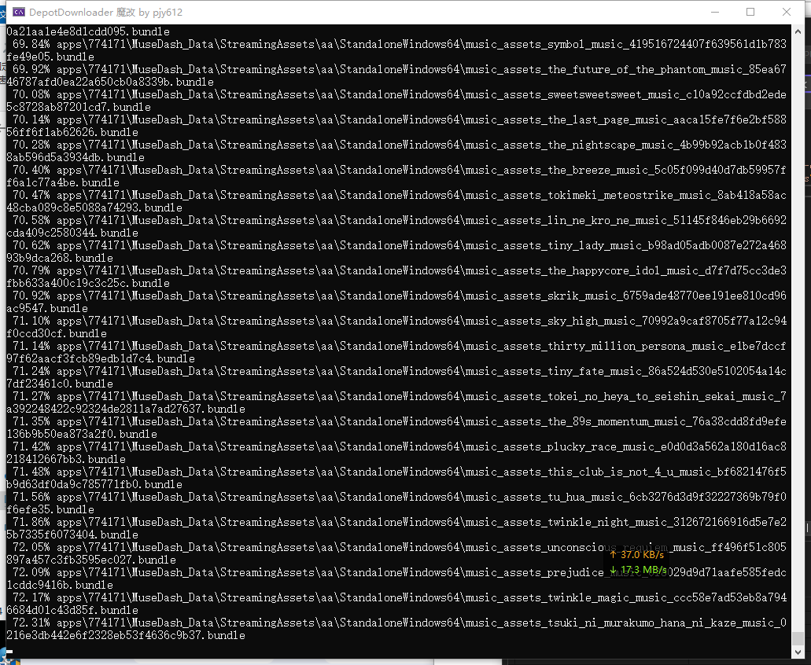
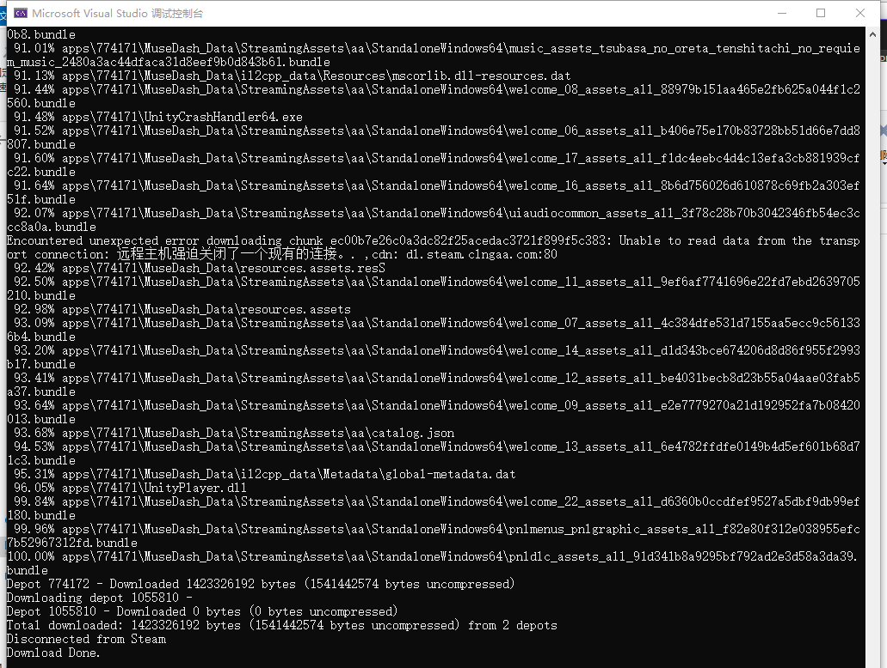
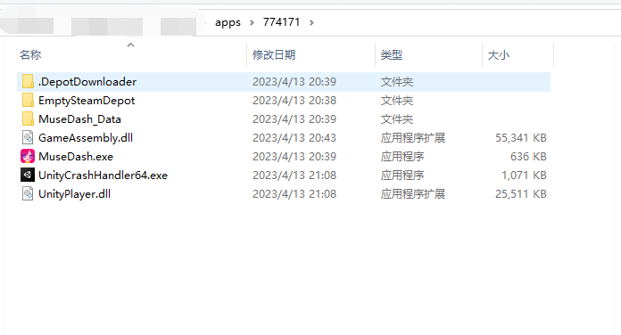

## 初衷  
以前下载Steam资源比较方便，但在Steam改了清单机制之后，就必须拥有游戏才能拿到Steam的清单。  
然后 有个大佬 **[wxy1343](https://github.com/wxy1343)** 就通过收集一些分享的离线号来提取收集清单。  
通过这些清单 可以从 Steam 的cdn上直接下载正版分流，至少比 挂种子和网盘来的快（应该...）  
但是 只有正版分流 不能玩怎么办？ 这就由会员们自己想办法咯~  
比如 tools 小绿人 模拟器 less 等...   

## ManifestDownload 【Steam清单下载器】
### 工具运行图  



### 工具说明  
清单数据来源：**[ManifestAutoUpdate](https://github.com/wxy1343/ManifestAutoUpdate)**  
通过 Steam 的 appid 来获取 app 对应的清单列表（最新，如果被仓库正常收录的话）  
当前收录 [在线文档](https://docs.google.com/spreadsheets/d/1tS-Tar11TAqnlaeh4c7kHJq-vHF8QiQ-EtcEy5NO8a8)  
Steam 的 appid 如何查看？
就比如 乡村8 ，通过 Steam商店 或 Steamdb 可以看到链接
```
https://store.steampowered.com/app/1196590/Resident_Evil_Village/  
https://steamdb.info/app/1196590/  
```
那个 1196590 就是 appid

更多细节可自行研究  
因为是访问GitHub的api获取数据，但是GitHub对 Api 的请求有频次限制。  
无token：60次/小时  
有token：5000次/小时  
所以 有必要 可以在GitHub上生成一个 空权限的 Person Token 放到配置文件中。

另外就是 虽然咱在使用中没出现被 qiang 的情况，但是 不排除万一...  
如果万一的话，还请自行研究使用魔法...  

**Ps.该软件本身没啥技术含量，但是为避免被修改文案后沦为 X宝 X鱼 的牟利工具，会简单加个壳。**

### 工具参数
```dos
::根据appid 下载资源清单
ManifestDownload.exe app [appid1 appid2]
ManifestDownload.exe app 1000
ManifestDownload.exe app 1000 2000

::根据manifest 下载 指定的清单（一般人用不上
ManifestDownload.exe manifest [manifestId1 manifestId2]
ManifestDownload.exe manifest 4004_2300048559188578691

::提取已下载清单中所有的解密密钥（app下载时会自动提取，DepotDownloader可能有用
ManifestDownload.exe dumpkey
```

## DepotDownloader（魔改） Steam资源下载器
### 工具运行图





### 工具说明
本工具魔改自 **[SteamRE/DepotDownloader](https://github.com/SteamRE/DepotDownloader)**  
加了一些便捷功能，比如
* 支持免登录下载  
* 缓存Steam原始清单
* 缓存解密清单
* 自动识别本地已有清单
* 支持指定ssfn 
* 添加额外 cdn 服务器
* 修复国内 cdn 请求限制的问题等

具体参数细项 和使用方法 参考原项目 ReadMe。  
为了安全起见，虽然本项目支持通过账号密码获取清单和下载资源但是 **不推荐使用自己的账号**  
如有必要使用账号模式，推荐使用 **离线号** 或 **分享号** 去下载。

**Ps.该软件虽然是魔改且上游开源协议为GPL2，但是为避免被修改文案后沦为 X宝 X鱼 的牟利工具，会简单加个壳。**

### 工具参数（含魔改后新特性）
```cmd
:: 免登录模式
::下载游戏的所有内容到 默认目录（默认会根据 depot 分别构建目录存放）
DepotDownloader.exe -app 904320
::下载游戏的 指定 depot 内容  到默认目录（默认会根据 depot 分别构建目录存放）
DepotDownloader.exe -app 904320 -depot 994710 904321

:: 【新特性】自动根据 appid 存放资源，会将资源全部放在 apps/appid 目录下
DepotDownloader.exe -useAppDir -app 338930

::下载游戏的所有内容到某个目录
DepotDownloader.exe -app 904320 -dir E:/GameName
::下载游戏的 指定 depot 内容 到某个目录
DepotDownloader.exe -app 904320 -depot 994710 904321 -dir E:/GameName

::通过指定清单下载游戏 (清单文件要放到 当前程序的 depotcache 内) depotId 和 manifestId 要一一对应
DepotDownloader.exe -app 534380 -depot 534381 -manifest 3462017367423786531 -useAppDir
DepotDownloader.exe -app 338930 -depot 338931 338932 347970 359000 359001 -manifest 1547401116504413409 3145636846994837120 7699221664155927697 2868566071607167109 761387674804236811 -useAppDir

::登录模式
::[新特性]通过账号和密码 还有 ssfn 登录 并下载游戏 (ssfn文件要放到当前程序目录)
DepotDownloader.exe -user 账号 -pass 密码 -ssfn ssfnxxxxxx -app 904320 -depot 994710 904321 -useAppDir

::登陆但是只获取 下载密钥和清单
DepotDownloader.exe -user 账号 -pass 密码 -ssfn ssfnxxxxx -app 904320 -manifest-only

::[新特性]只获取游戏清单信息 并尝试生成解密清单(位于depotcache_decrypt目录) (解密清单应该可以支持无密钥下载游戏)
DepotDownloader.exe -user 账号 -pass 密码 -ssfn ssfnxxxxxxxxxxxxxx -app 904320 -manifest-only -dm

::[新特性]额外指定的cdn
DepotDownloader.exe -app 904320 -cdn steampipe.akamaized.net:80,trts.baishancdnx.cn:80

::[新特性]强制通过depotid下载（有的游戏 app有请求限制 导致无法自动获取 depot 列表）
DepotDownloader.exe -app 338930 -depot 338931 338932 347970 359000 359001 -forceDepot
```
